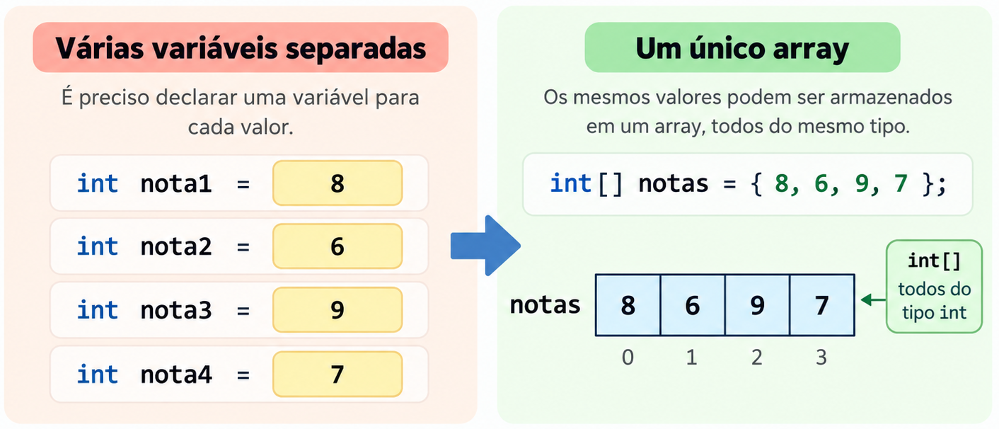

<!-- _class: title -->
<!-- _paginate: false -->

## Programação Orientada a Objetos

# Arrays em Java

<div class="objectives">

**Objetivos da aula**

- Declarar, criar, inicializar e percorrer arrays
- Usar índices, `length` e `enhanced for`
- Passar arrays a métodos e compreender referências
- Trabalhar com arrays multidimensionais e irregulares
- Utilizar `varargs` e métodos da classe `Arrays`

</div>

<div class="contact">
2026.2<br>
Prof. Fabricio Santana<br>
fabricio.santana@idp.edu.br<br>
www.linkedin.com/in/fabriciofsantana/
</div>

---

<!-- _class: compact -->

# Por que arrays?

Em vez de declarar uma variável para cada valor, um array reúne elementos **do mesmo tipo** em uma estrutura indexada.


<div style="text-align: center;">



</div>

---

<!-- _class: compact -->

# Array

<div class="columns">
<div>

**Característica de um Array**

- É um objeto por referência
- Pode guardar primitivos ou referências
- Possui tamanho fixo após a criação
- Todos os elementos devem ser do mesmo tipo
- Seus elementos são acessados por índice, começando em `0`

</div>
<div>

**Exemplos**

- Notas de uma turma: `double[]`
- Nomes de participantes: `String[]`
- Frequência de resultados: `int[]`
- Tabela de valores: `int[][]`

</div>
</div>

---

<!-- _class: compact -->

# Declaração, criação e inicialização

<div class="columns">
<div>

**Criação com tamanho**

```java
int[] values = new int[5];
String[] names = new String[3];
```

- `new` cria o objeto array
- O tamanho deve ser inteiro não negativo
- `values` e `names` guardam referências

</div>
<div>

**Inicialização com valores**

```java
int[] scores = {10, 20, 30};
int[] other = new int[] {10, 20, 30};
```

- O tamanho é inferido pelos elementos
- A primeira forma vale na declaração
- `new int[] {...}` pode aparecer em outras expressões

</div>
</div>

> Prefira `int[] values` a `int values[]`: o tipo array fica explícito junto do tipo do elemento.

---

<!-- _class: compact -->

# Valores padrão dos elementos

Os elementos de um array criado com `new` recebem valores padrão antes de qualquer atribuição.

<table class="small">
<thead><tr><th>Tipo do elemento</th><th>Valor padrão</th><th>Exemplo</th></tr></thead>
<tbody>
<tr><td>Numérico primitivo</td><td><code>0</code> ou equivalente</td><td><code>new int[3]</code> → <code>{0, 0, 0}</code></td></tr>
<tr><td><code>boolean</code></td><td><code>false</code></td><td><code>new boolean[2]</code></td></tr>
<tr><td>Referência</td><td><code>null</code></td><td><code>new String[2]</code></td></tr>
</tbody>
</table>

- Criar `new Student[3]` **não cria três estudantes**; cria três posições `null`
- Um elemento de referência precisa apontar para um objeto antes de usar seus métodos
- Variáveis locais, diferentemente de elementos do array, não recebem inicialização automática

---

# Índices e propriedade _length_

```java
int[] values = {32, 27, 64};
int first = values[0];                 // 32
int last = values[values.length - 1]; // 64
```

- O primeiro índice é `0`
- O último índice válido é `length - 1`
- `length` é uma **atributo do array**, sem parênteses
- Índices devem estar entre `0` e `length - 1`
- Um array vazio tem `length == 0` e não possui primeiro elemento
- Acesso fora desse intervalo dispara `ArrayIndexOutOfBoundsException`

> `array.length` é diferente de `text.length()`, que é método de `String`.

---

# Iterar pelos ementos usando _for_

```java
int[] values = {32, 27, 64, 18};

for (int index = 0; index < values.length; index++) {
    System.out.printf("%d → %d%n", index, values[index]);
}
```

- Use `index < values.length`, não `<=`
- O índice permite localizar, substituir ou comparar posições
- `values[index] = 99` modifica um elemento existente
- O comprimento do array não muda com uma atribuição

> Se a posição do elemento influencia a lógica, use `for` com índice.

</div>

---

<!-- _class: practice -->
<!-- _paginate: false -->

# Array: demonstração

<iframe class="compiler-frame"
  src="https://onecompiler.com/embed/java/453d3vq23?hideTitle=false&hideLanguageSelection=false&hideNew=false&hideNewFileOption=false&hideStdin=false&hideResult=false&hideEditorOptions=false&availableLanguages=true&disableAutoComplete=true&theme=light&fontSize=14"
  title="OneCompiler Java — índices e length"
  allow="clipboard-read; clipboard-write"></iframe>

---

<!-- _class: compact -->

# _enhanced for (for-each)_: iterar pelos valores

```java
int[] grades = {8, 7, 10};
int total = 0;

for (int grade : grades) {
    total += grade;
}

double average = (double) total / grades.length;
```

- Ideal quando o índice não é necessário
- Visita os elementos em ordem
- A variável da iteração recebe o valor de cada elemento
- Atribuir à variável `grade` **não altera** `grades`
- Verifique `length > 0` antes de calcular uma média

---

<!-- _class: practice -->
<!-- _paginate: false -->

# Demostração: estatísticas com _enhanced for_

<iframe class="compiler-frame"
  src="https://onecompiler.com/embed/java/453d43w24?hideTitle=false&hideLanguageSelection=false&hideNew=false&hideNewFileOption=false&hideStdin=false&hideResult=false&hideEditorOptions=false&availableLanguages=true&disableAutoComplete=true&theme=light&fontSize=14"
  title="OneCompiler Java — for aprimorado e estatísticas"
  allow="clipboard-read; clipboard-write"></iframe>

---

<!-- _class: compact -->

# Frequências com array

Um array também pode representar contadores: cada posição corresponde a uma categoria.

```java
int[] frequency = new int[7]; // posições 1 a 6
int[] rolls = {1, 3, 6, 3, 1, 6};

for (int result : rolls) {
    frequency[result]++;
}
```

- `frequency[0]` fica sem uso neste modelo
- Valide `result` antes de usar como índice se os dados vêm de fora
- Os valores padrão `0` permitem começar a contagem
- É possível construir gráficos de barras com iterações aninhados

---

<!-- _class: practice -->
<!-- _paginate: false -->

# Demonstração: frequências e barras

<iframe class="compiler-frame"
  src="https://onecompiler.com/embed/java/453d457jh?hideTitle=false&hideLanguageSelection=false&hideNew=false&hideNewFileOption=false&hideStdin=false&hideResult=false&hideEditorOptions=false&availableLanguages=true&disableAutoComplete=true&theme=light&fontSize=14"
  title="OneCompiler Java — frequência e gráfico de barras"
  allow="clipboard-read; clipboard-write"></iframe>

---

<!-- _class: compact -->

# Acesso inválido e tratamento de exceção

- Algumas operações com arrays podem gerar um comportamento inesperado
- O bloco `try-catch` permite capturar e tratar esses comportamentos

```java
int[] values = {10, 20, 30};

try {
    System.out.println(values[3]);
} catch (ArrayIndexOutOfBoundsException error) {
    System.out.println("Índice fora do array");
}
```

- `try` contém a operação que pode falhar
- `catch` recebe a exceção e define o tratamento
- A exceção não aumenta o array nem cria um elemento inexistente
- Prefira prevenir o erro com limites corretos
- Use tratamento quando um erro ainda for possível e houver tratamento adequado

---

# Arrays como parâmetros

```java
static void doubleFirst(int[] values) {
    if (values.length > 0) {
        values[0] *= 2;
    }
}
```

- Java passa **por valor** uma cópia da referência ao array
- O método e o chamador alcançam o mesmo objeto
- Alterar `values[0]` altera o elemento visto pelo chamador
- Reatribuir `values = new int[5]` altera só a referência local
- Passar `values[0]` como `int` envia uma cópia daquele número

> Não confunda “cópia da referência” com “cópia do array”.

---

<!-- _class: practice -->
<!-- _paginate: false -->

# Parâmetros e referências: demonstração

<iframe class="compiler-frame"
  src="https://onecompiler.com/embed/java/453d46da3?hideTitle=false&hideLanguageSelection=false&hideNew=false&hideNewFileOption=false&hideStdin=false&hideResult=false&hideEditorOptions=false&availableLanguages=true&disableAutoComplete=true&theme=light&fontSize=14"
  title="OneCompiler Java — arrays como parâmetros"
  allow="clipboard-read; clipboard-write"></iframe>

---

# Arrays de objetos

```java
Student[] students = new Student[2];
students[0] = new Student("Ana", 20, "Direito");
students[1] = new Student("Bia", 21, "Computação");
```

- O array armazena **referências** a objetos `Student`
- Antes das atribuições, ambas as posições são `null`
- Objetos do mesmo tipo podem compartilhar métodos e ter estados distintos
- Cada elemento pode apontar para uma subclasse de `Student`, se houver
- Um array não cria nem valida automaticamente seus objetos

---

# Arrays multidimensionais

Em Java, um `int[][]` é um **array de arrays**.

```java
int[][] table = {
    {1, 2, 3},
    {4, 5, 6}
};

int value = table[1][2]; // 6
```

- Primeiro índice: linha; segundo: coluna
- `table.length` informa o número de linhas
- `table[row].length` informa as colunas daquela linha
- Não há garantia de bloco bidimensional contíguo de memória
- Cada linha pode ter tamanho diferente

---

<!-- _class: practice -->
<!-- _paginate: false -->

# Tabela bidimensional: demonstração

<iframe class="compiler-frame"
  src="https://onecompiler.com/embed/java/453d47xkc?hideTitle=false&hideLanguageSelection=false&hideNew=false&hideNewFileOption=false&hideStdin=false&hideResult=false&hideEditorOptions=false&availableLanguages=true&disableAutoComplete=true&theme=light&fontSize=14"
  title="OneCompiler Java — array bidimensional"
  allow="clipboard-read; clipboard-write"></iframe>

---

<!-- _class: compact -->

# Arrays irregulares

```java
int[][] seats = new int[3][];
seats[0] = new int[2];
seats[1] = new int[4];
seats[2] = new int[3];
```

- A primeira criação estabelece três posições para linhas
- Cada linha nasce `null` até receber seu próprio array
- `seats[row].length` pode variar
- A iteração interna deve respeitar a linha corrente
- Tentar usar `seats[row][column]` antes de criar a linha lança `NullPointerException`

> Uma tabela irregular é útil para grupos naturalmente heterogêneos, sem desperdiçar posições.

---

<!-- _class: practice -->
<!-- _paginate: false -->

# Array irregular: demonstração

<iframe class="compiler-frame"
  src="https://onecompiler.com/embed/java/453d49ah4?hideTitle=false&hideLanguageSelection=false&hideNew=false&hideNewFileOption=false&hideStdin=false&hideResult=false&hideEditorOptions=false&availableLanguages=true&disableAutoComplete=true&theme=light&fontSize=14"
  title="OneCompiler Java — array irregular"
  allow="clipboard-read; clipboard-write"></iframe>

---

# _String[] args_ no método _main_

```java
public static void main(String[] args) {
    for (String argument : args) {
        System.out.println(argument);
    }
}
```

```console
$ java Main 5 0 4
5
0
4
```

- `args` é um array de `String` fornecido pela execução do programa
- Os três argumentos chegam nas posições `0`, `1` e `2`
- Para obter números, é necessário converter: `Integer.parseInt(args[0])`
- Verifique `args.length` antes de acessar posições

---

<!-- _class: compact -->

# Parâmetros variáveis: _varargs_

```java
static double average(double... numbers) {
    if (numbers.length == 0) {
        throw new IllegalArgumentException("Informe valores");
    }

    double total = 0.0;
    for (double number : numbers) {
        total += number;
    }
    return total / numbers.length;
}
```

- Permite `average(5, 7, 9)` ou `average(new double[] {5, 7, 9})`
- Internamente, `numbers` é um array
- Há no máximo um parâmetro `varargs` e ele deve ser o último
- A chamada sem valores é possível; o método precisa definir seu contrato

---

<!-- _class: practice -->
<!-- _paginate: false -->

# _varargs_: demonstração

<iframe class="compiler-frame"
  src="https://onecompiler.com/embed/java/453d4b67h?hideTitle=false&hideLanguageSelection=false&hideNew=false&hideNewFileOption=false&hideStdin=false&hideResult=false&hideEditorOptions=false&availableLanguages=true&disableAutoComplete=true&theme=light&fontSize=14"
  title="OneCompiler Java — varargs"
  allow="clipboard-read; clipboard-write"></iframe>

---

<!-- _class: compact -->

# Utilitários de _java.util.Arrays_

A classe `Arrays` fornece métodos **estáticos** prontos para operações comuns.

<table class="small">
<thead><tr><th>Método</th><th>Uso</th><th>Atenção</th></tr></thead>
<tbody>
<tr><td><code>toString</code></td><td>Representação legível</td><td><code>println(array)</code> não lista os elementos</td></tr>
<tr><td><code>sort</code></td><td>Ordenar no próprio array</td><td>Modifica a ordem original</td></tr>
<tr><td><code>fill</code></td><td>Preencher com um valor</td><td>Substitui elementos existentes</td></tr>
<tr><td><code>copyOf</code></td><td>Copiar com novo tamanho</td><td>Novo array; não redimensiona o antigo</td></tr>
<tr><td><code>equals</code></td><td>Comparar elementos</td><td><code>==</code> compara referências</td></tr>
<tr><td><code>binarySearch</code></td><td>Buscar em array ordenado</td><td>Ordene antes; posição negativa indica ausência</td></tr>
</tbody>
</table>

<div class="source"><a href="https://docs.oracle.com/en/java/javase/21/docs/api/java.base/java/util/Arrays.html">Referência: java.util.Arrays — Java SE 21</a></div>

---

<!-- _class: practice -->
<!-- _paginate: false -->

# Arrays: demonstração

<iframe class="compiler-frame"
  src="https://onecompiler.com/embed/java/453d4cpw4?hideTitle=false&hideLanguageSelection=false&hideNew=false&hideNewFileOption=false&hideStdin=false&hideResult=false&hideEditorOptions=false&availableLanguages=true&disableAutoComplete=true&theme=light&fontSize=14"
  title="OneCompiler Java — utilitários Arrays"
  allow="clipboard-read; clipboard-write"></iframe>

---

# Tamanho fixo e custo de operações

- Acesso a `array[index]` é direto: custo **O(1)**
- Percorrer ou somar todos os elementos custa **O(n)**
- Ordenação exige mais trabalho que uma simples leitura
- `Arrays.copyOf(array, newLength)` cria outro array e copia elementos: **O(n)**
- O array original mantém seu tamanho e conteúdo


> Quando o conjunto cresce e diminui ao longo da execução, estruturas do _Java Collections Framework_ podem ser mais adequadas. Arrays continuam úteis quando o tamanho é fixo e conhecido.

---

# Boas práticas

- Use nomes no plural para arrays que representam grupos
- Valide entradas externas antes de usá-las como índices
- Use `for` com índice quando a posição importa
- Use `for` aprimorado quando só os valores importam
- Verifique arrays vazios antes de processar ou acessar a primeira posição
- Em arrays de objetos, trate posições ainda `null`
- Copie arrays recebidos quando a classe precisa proteger seu estado
- Não use exceções como substituto de limites corretos
- Separe processamento dos dados e interação com o usuário

---

# Síntese da aula

- Arrays são objetos indexados, com elementos de mesmo tipo e de tamanho fixo
- `length` informa o tamanho; índices válidos vão de `0` a `length - 1`
- Elementos criados com `new` recebem valores padrão
- `for` e _enhanced-for (for-each)_ `for( : )` atendem necessidades distintas
- Java passa uma cópia da referência do array aos métodos
- Arrays multidimensionais são arrays de arrays e podem ser irregulares
- `varargs` recebe quantidade variável como um array
- `java.util.Arrays` oferece operações úteis de cópia, ordenação e comparação

<div class="source">Referências: <a href="https://docs.oracle.com/javase/specs/jls/se21/html/jls-10.html">JLS 10 — Arrays</a>; <a href="https://docs.oracle.com/en/java/javase/21/docs/api/java.base/java/util/Arrays.html">Arrays — Java SE 21</a>; DEITEL, Paul; DEITEL, Harvey. <em>Java: How to Program, Early Objects</em>. 11. ed.</div>
