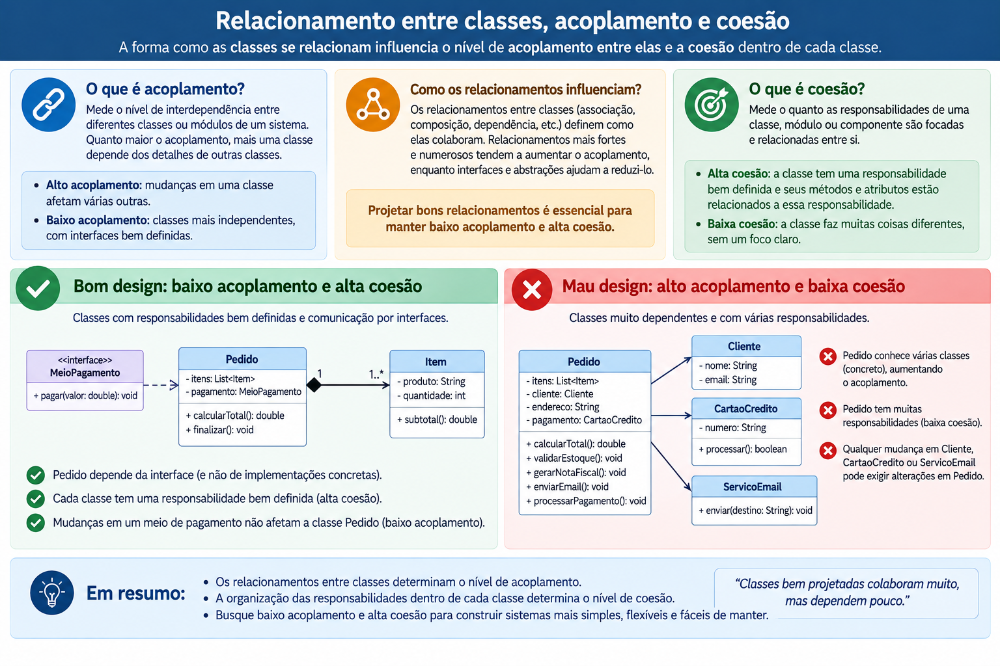
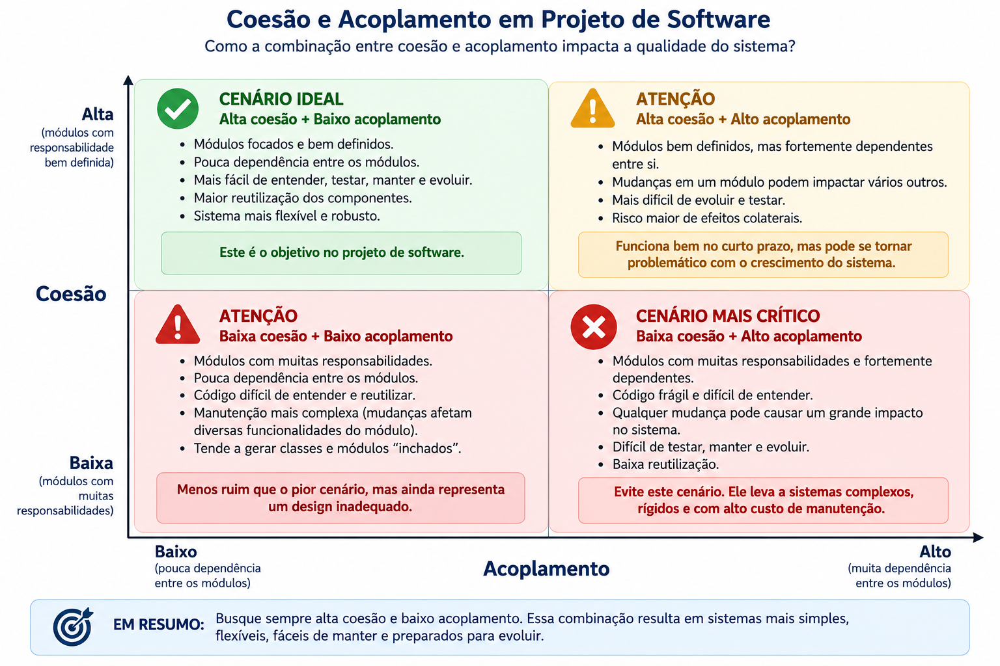
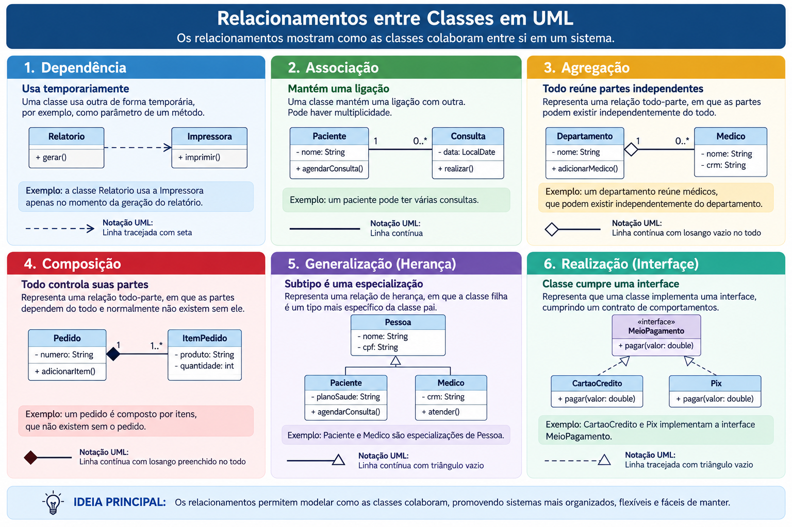
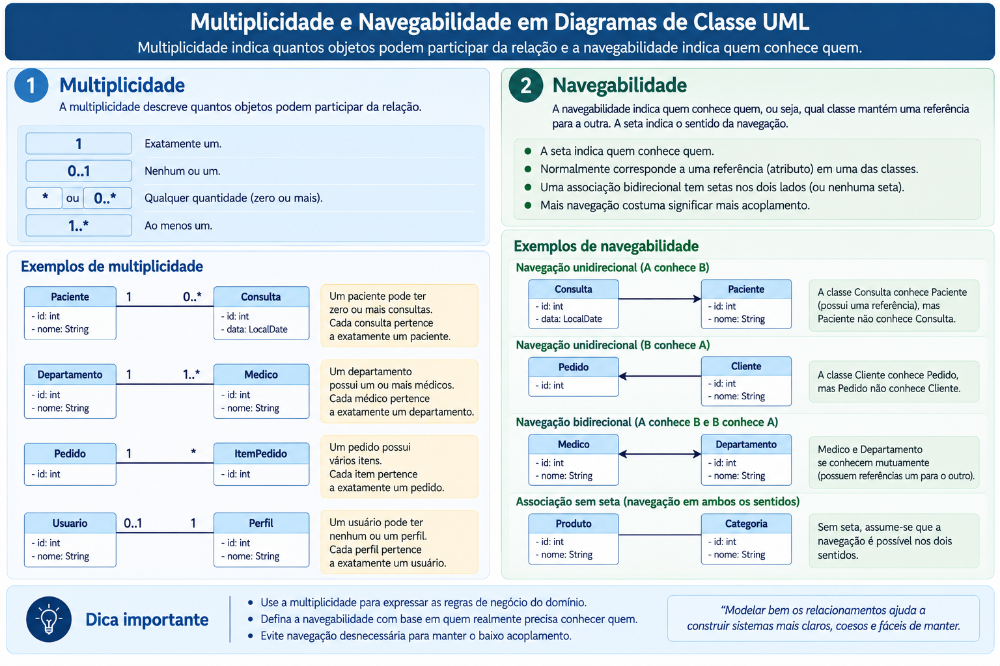

<!-- _class: title -->
<!-- _paginate: false -->

## Programação Orientada a Objetos

# Introdução à Modelagem Orientada a Objetos: relacionamentos entre classes

**Objetivos da aula**

- Identificar os tipos de relacionamentos entre classes
  - `dependência`, `associação`, `agregação`, `composição`, `generalização` e `realização`
- Interpretar relacionamentos em diagramas UML
- Implementar colaborações entre objetos
- Criar hierarquias de classes
  - `extends`, `super` e `abstract class`
- Aplicar sobrescrita, polimorfismo e conversões
  - `@Override`, `instanceof`

2026.2 
Prof. Fabricio Santana 
fabricio.santana@idp.edu.br 
www.linkedin.com/in/fabriciofsantana/

---

# Classes e Objetos

- **Classe**: modela dados e comportamentos de um conceito

- **Objeto** é uma instância concreta de uma classe

- **Relacionamentos**: os **objetos** podem colaborar entre si

---

# Relacionamento entre classes

---

# Acoplamento x Coesão

**Acoplamento**

- baixo acoplamento (desacoplado): as classes operam de forma independente, alterar um módulo não quebra ou afeta o funcionamento dos outros
- alto acoplamento: as classes estão profundamente conectados, mudar uma linha de código em um componente exige alterações em vários outros lugares

**Coesão**

- alta coesão: a classe possui um propósito único e bem definido. Cada parte dele trabalha para realizar uma única tarefa
- baixa coesão: a classe acumula várias responsabilidades que não possuem relação direta, funcionando como um "faz-tudo" desorganizado

---

# Acoplamento x Coesão

---

# Relacionamentos entre classes

**Perguntas de modelagem**

- Uma classe apenas usa a outra?
- Uma mantém referência para a outra?
- Quem cria e controla o ciclo de vida?
- Existe especialização ou contrato comum?

**Efeitos no código**

- Parâmetros e variáveis locais
- Atributos que guardam referências
- Criação e proteção das partes
- `extends`, `implements` e polimorfismo

---

<!-- _class: compact -->

# Tipos de relaciomanetos entre classes e objetos

---

<!-- _class: compact -->

# Multiplicidade e navegabilidade

---

<!-- _class: compact -->

# Dependência

> Uma classe depende de outra quando a utiliza temporariamente para realizar uma operação.

- Surge em parâmetros, variáveis locais, retornos ou chamadas estáticas
- O objeto usado não precisa permanecer armazenado
- É o relacionamento estrutural mais fraco
- Alterações no contrato usado ainda podem afetar o cliente

  - `ReportService` recebe um `Formatter` apenas durante `generate`; depois da chamada, não conserva a referência.

---

<!-- _class: practice -->
<!-- _paginate: false -->

# Dependência: demonstração

<iframe
  class="compiler-frame"
  src="https://onecompiler.com/embed/java/4526svvwy?hideTitle=false&hideLanguageSelection=false&hideNew=false&hideNewFileOption=false&hideStdin=false&hideResult=false&hideEditorOptions=false&availableLanguages=true&disableAutoComplete=true&theme=light&fontSize=14"
  title="OneCompiler Java — dependência"
  allow="clipboard-read; clipboard-write"></iframe>

---

<!-- _class: compact -->

# Associação

> Associação representa uma ligação duradoura entre objetos

- Uma classe mantém referência para a outra em um atributo
- Pode ser unidirecional ou bidirecional
- Pode apresentar diferentes multiplicidades
- Um objeto não controla necessariamente a existência do outro

- `Teacher` conhece a disciplina que ministra, mas `Course` é criado e pode existir independentemente do professor.

---

<!-- _class: practice -->
<!-- _paginate: false -->

# Associação: demonstração

<iframe
  class="compiler-frame"
  src="https://onecompiler.com/embed/java/4526ssc6t?hideTitle=false&hideLanguageSelection=false&hideNew=false&hideNewFileOption=false&hideStdin=false&hideResult=false&hideEditorOptions=false&availableLanguages=true&disableAutoComplete=true&theme=light&fontSize=14"
  title="OneCompiler Java — associação"
  allow="clipboard-read; clipboard-write"></iframe>

---

<!-- _class: compact -->

# Agregação

> Agregação é uma associação todo–parte em que as partes possuem ciclo de vida independente

- O todo normalmente recebe objetos já existentes
- A parte pode existir sem o todo
- A parte pode ser transferida ou compartilhada conforme o domínio
- UML representa o todo com um losango vazio

- `Team` reúne jogadores recebidos pelo construtor; destruir a equipe não destrói conceitualmente os jogadores.

---

<!-- _class: practice -->
<!-- _paginate: false -->

# Agregação: demonstração

<iframe
  class="compiler-frame"
  src="https://onecompiler.com/embed/java/4526sf9xf?hideTitle=false&hideLanguageSelection=false&hideNew=false&hideNewFileOption=false&hideStdin=false&hideResult=false&hideEditorOptions=false&availableLanguages=true&disableAutoComplete=true&theme=light&fontSize=14"
  title="OneCompiler Java — agregação"
  allow="clipboard-read; clipboard-write"></iframe>

---

<!-- _class: compact -->

# Composição

> Composição é uma associação todo–parte em que o todo controla a criação e o ciclo de vida das partes.

- A parte pertence a um único todo por vez
- A parte não possui significado independente naquele modelo
- O todo protege as invariantes do conjunto
- UML representa o todo com um losango preenchido

- `Order` cria seus itens e não permite construí-los externamente; o item existe como parte daquele pedido.

---

<!-- _class: practice -->
<!-- _paginate: false -->

# Composição: demonstração

<iframe
  class="compiler-frame"
  src="https://onecompiler.com/embed/java/4526sj5vr?hideTitle=false&hideLanguageSelection=false&hideNew=false&hideNewFileOption=false&hideStdin=false&hideResult=false&hideEditorOptions=false&availableLanguages=true&disableAutoComplete=true&theme=light&fontSize=14"
  title="OneCompiler Java — composição"
  allow="clipboard-read; clipboard-write"></iframe>

---

# Herança

> Herança permite declarar uma classe mais específica a partir de outra, reaproveitando membros acessíveis e adicionando ou redefinindo comportamentos.

**Superclasse**

- Representa o conceito mais geral
- Declara estado e comportamento comuns
- Também chamada classe base

**Subclasse**

- Representa uma especialização
- Pode acrescentar novos membros
- Também chamada classe derivada

Uma superclasse pode ser direta ou indireta. O conjunto dessas relações forma uma **hierarquia de classes**.

---

# Herança: exemplo

O triângulo aponta para o tipo mais geral. `BasePlusCommissionEmployee` possui uma superclasse direta e também uma superclasse indireta.

---

<!-- _class: compact -->

# Relações _is-a_ e _has-a_

**Herança**: 

- relação do tipo é-um(_is-a_)
- `SalariedEmployee` é um `Employee`
- `SalariedEmployee` `extends` `Employee`
- A subclasse deve poder substituir o tipo base
- A especialização preserva o contrato comum

**Composição**:

- relação do tipo  tem-um(_has-a_)
- `Car` tem um `Engine`
- O objeto delega trabalho a um colaborador
- A implementação pode ser substituída com flexibilidade

---

# Herança simples em Java

- Uma classe possui no máximo **uma superclasse direta**
- `extends` declara a relação de herança
- A subclasse herda membros acessíveis, mas não construtores
- Pode acrescentar atributos e métodos próprios
- Pode sobrescrever métodos herdados permitidos
- Toda classe deriva direta ou indiretamente de `java.lang.Object`

**Ideia central**

O objeto da subclasse contém o estado da parte herdada e da parte especializada. A visibilidade desse estado continua sendo controlada pelos modificadores de acesso.

---

<!-- _class: practice -->
<!-- _paginate: false -->

# Herança: demostração _extends_

<iframe
  class="compiler-frame"
  src="https://onecompiler.com/embed/java/4526qdcsv?hideTitle=false&hideLanguageSelection=false&hideNew=false&hideNewFileOption=false&hideStdin=false&hideResult=false&hideEditorOptions=false&availableLanguages=true&disableAutoComplete=true&theme=light&fontSize=14"
  title="OneCompiler Java — herança básica"
  allow="clipboard-read; clipboard-write"></iframe>

---

<!-- _class: compact -->

# Membros herdados e acesso

<table class="small">
<thead><tr><th>Modificador</th><th>Acesso na subclasse</th><th>Orientação</th></tr></thead>
<tbody>
<tr><td><code>public</code></td><td>Sim</td><td>API disponível aos clientes</td></tr>
<tr><td><code>protected</code></td><td>Conforme pacote e herança</td><td>Use para extensão planejada</td></tr>
<tr><td>Sem modificador</td><td>Somente no mesmo pacote</td><td>API interna do pacote</td></tr>
<tr><td><code>private</code></td><td>Não diretamente</td><td>Preserva o encapsulamento da base</td></tr>
</tbody>
</table>

- Um atributo `private` faz parte do objeto, mas só a classe que o declarou pode acessá-lo diretamente
- A subclasse deve usar as operações disponibilizadas pela superclasse
- Expor estado como `protected` aumenta o acoplamento e pode permitir a quebra de invariantes

> Prefira estado `private` e métodos `protected` bem definidos quando forem necessários pontos de extensão.

---

<!-- _class: compact -->

# Particularidades de `protected`

`protected` combina duas formas de acesso:

- Classes do **mesmo pacote** acessam o membro, mesmo sem herança
- Subclasses em **outro pacote** acessam o membro por meio da herança
- Fora do pacote, a subclasse não pode usar uma referência arbitrária da superclasse para acessar o membro protegido

**Decisão de projeto**

`protected` não significa “privado para subclasses”. Ele amplia a superfície de manutenção da classe e deve ser usado apenas quando a hierarquia foi projetada para extensão.

---

# Construtores e `super`

- Construtores **não são herdados** nem sobrescritos
- A construção de uma subclasse começa pela inicialização da superclasse
- `super(argumentos)` seleciona um construtor da superclasse
- No Java 21, `super(...)` ou `this(...)`, quando explícito, deve ser a primeira instrução
- Sem chamada explícita, o compilador insere `super()`
- Sem construtor acessível sem parâmetros na superclasse, a chamada explícita é obrigatória

**Ordem de inicialização**

Parte de `Object` → parte da superclasse → parte da subclasse.

Essa ordem garante que a base do objeto esteja válida antes da especialização.

---

<!-- _class: practice -->
<!-- _paginate: false -->

# `super`: cadeia de construção

<iframe
  class="compiler-frame"
  src="https://onecompiler.com/embed/java/4526qhvsv?hideTitle=false&hideLanguageSelection=false&hideNew=false&hideNewFileOption=false&hideStdin=false&hideResult=false&hideEditorOptions=false&availableLanguages=true&disableAutoComplete=true&theme=light&fontSize=14"
  title="OneCompiler Java — construtores e super"
  allow="clipboard-read; clipboard-write"></iframe>

---

# Sobrescrita de métodos

Uma subclasse pode fornecer nova implementação para um método de instância herdado.

- Mantém o nome e a lista de parâmetros
- O retorno deve ser igual ou covariante
- A visibilidade não pode ser reduzida
- `@Override` solicita ao compilador a verificação da sobrescrita
- `super.metodo()` permite reutilizar a implementação da superclasse

**Sobrescrita — _override_**

- Mesma assinatura em classes relacionadas
- Escolha em tempo de execução
- Produz comportamento polimórfico

**Sobrecarga — _overload_**

- Mesmo nome, parâmetros diferentes
- Pode ocorrer na mesma classe
- Escolha em tempo de compilação

---

# Polimorfismo

> Polimorfismo permite usar uma referência de um tipo geral para manipular objetos de diferentes subclasses.

- A atribuição de uma subclasse a uma superclasse é um **upcast** implícito
- A referência determina quais membros são acessíveis na compilação
- O objeto real determina qual implementação sobrescrita é executada
- Essa seleção em tempo de execução é chamada **despacho dinâmico**

**Consequência**

O cliente depende do contrato comum. Novas subclasses podem fornecer comportamentos diferentes sem alterar o laço que processa os objetos.

---

<!-- _class: practice -->
<!-- _paginate: false -->

# Polimorfismo: folha de pagamento

<iframe
  class="compiler-frame"
  src="https://onecompiler.com/embed/java/4526qnvyj?hideTitle=false&hideLanguageSelection=false&hideNew=false&hideNewFileOption=false&hideStdin=false&hideResult=false&hideEditorOptions=false&availableLanguages=true&disableAutoComplete=true&theme=light&fontSize=14"
  title="OneCompiler Java — folha de pagamento polimórfica"
  allow="clipboard-read; clipboard-write"></iframe>

---

<!-- _class: compact -->

# Tipos da referência e do objeto

Considere uma referência `Employee` apontando para um `HourlyEmployee`.

<table class="small">
<thead><tr><th>Decisão</th><th>Responsável</th><th>Momento</th></tr></thead>
<tbody>
<tr><td>Quais membros podem ser chamados</td><td>Tipo declarado da referência</td><td>Compilação</td></tr>
<tr><td>Qual método sobrescrito será executado</td><td>Tipo real do objeto</td><td>Execução</td></tr>
</tbody>
</table>

- Uma referência ao tipo base não expõe operações exclusivas da subclasse
- Isso reduz dependência de detalhes concretos
- A identidade e o estado do objeto não mudam durante o upcast
- O despacho dinâmico ocorre apenas para métodos de instância sobrescritos

---

<!-- _class: compact -->

# Limites do polimorfismo

<table class="small">
<thead><tr><th>Membro</th><th>Comportamento</th></tr></thead>
<tbody>
<tr><td>Método de instância sobrescrito</td><td>Polimórfico; selecionado pelo objeto real</td></tr>
<tr><td>Atributo</td><td>Não é polimórfico; acesso depende do tipo da referência</td></tr>
<tr><td>Método <code>static</code></td><td>Pode ser ocultado, não sobrescrito; resolução pelo tipo</td></tr>
<tr><td>Método <code>private</code></td><td>Não é herdado pela subclasse nem sobrescrito</td></tr>
<tr><td>Construtor</td><td>Não é herdado nem sobrescrito</td></tr>
</tbody>
</table>

> Métodos `static` e `private` não são “implicitamente `final`”. Eles deixam de participar do despacho polimórfico por regras diferentes.

---

# Conversões de referência e `instanceof`

- **Upcast:** conversão para um tipo ancestral; segura e normalmente implícita
- **Downcast:** conversão para um subtipo; exige verificação em execução
- Um cast incompatível lança `ClassCastException`
- `instanceof` verifica o tipo antes de acessar comportamento específico
- O _pattern matching_ reúne teste e variável em uma expressão

**Sinal de projeto**

Muitos testes `instanceof` podem indicar que um comportamento deveria estar no contrato polimórfico, evitando decisões externas sobre o tipo concreto.

---

<!-- _class: practice -->
<!-- _paginate: false -->

# `instanceof`: especialização segura

<iframe
  class="compiler-frame"
  src="https://onecompiler.com/embed/java/4526qsjzy?hideTitle=false&hideLanguageSelection=false&hideNew=false&hideNewFileOption=false&hideStdin=false&hideResult=false&hideEditorOptions=false&availableLanguages=true&disableAutoComplete=true&theme=light&fontSize=14"
  title="OneCompiler Java — instanceof e pattern matching"
  allow="clipboard-read; clipboard-write"></iframe>

---

# Classes abstratas

Uma classe abstrata representa um conceito incompleto, adequado como base da hierarquia.

- É declarada com `abstract`
- Não pode ser instanciada diretamente
- Pode declarar atributos, construtores e métodos concretos
- Pode declarar métodos abstratos, sem corpo
- Uma classe com método abstrato também deve ser abstrata
- A primeira subclasse concreta deve implementar os métodos abstratos herdados

> `Employee` compartilha identidade e dados comuns, mas cada categoria calcula `earnings()` de forma diferente.

Construtores e métodos `static` não podem ser abstratos: construtores inicializam uma classe específica e métodos estáticos não participam do despacho por objeto.

---

<!-- _class: compact -->

# Classes abstratas e concretas

<table class="small">
<thead><tr><th>Característica</th><th>Classe abstrata</th><th>Classe concreta</th></tr></thead>
<tbody>
<tr><td>Instanciação direta</td><td>Não permitida</td><td>Permitida</td></tr>
<tr><td>Métodos com implementação</td><td>Permitidos</td><td>Permitidos</td></tr>
<tr><td>Métodos abstratos</td><td>Permitidos</td><td>Não permitidos</td></tr>
<tr><td>Construtores</td><td>Permitidos; chamados por subclasses</td><td>Permitidos</td></tr>
<tr><td>Finalidade</td><td>Compartilhar base e contrato parcial</td><td>Representar objetos completos</td></tr>
</tbody>
</table>

Uma referência pode ter tipo abstrato, desde que aponte para um objeto de uma subclasse concreta.

---

# A classe `Object`

Toda classe Java herda direta ou indiretamente de `java.lang.Object`.

<table class="small">
<thead><tr><th>Método</th><th>Responsabilidade</th></tr></thead>
<tbody>
<tr><td><code>toString()</code></td><td>Produzir representação textual</td></tr>
<tr><td><code>equals(Object)</code></td><td>Comparar igualdade lógica</td></tr>
<tr><td><code>hashCode()</code></td><td>Produzir valor usado por estruturas de dispersão</td></tr>
<tr><td><code>getClass()</code></td><td>Obter o tipo real em execução</td></tr>
</tbody>
</table>

- Ao sobrescrever `equals`, sobrescreva também `hashCode`
- `toString` já foi sobrescrito na aula anterior
- `equals` recebe `Object` porque deve aceitar qualquer referência
- `clone` existe em `Object`, mas é `protected` e exige cuidados específicos

---

# Controle da extensão com `final` e `sealed`

- Uma classe `final` não pode ser estendida
- Um método de instância `final` não pode ser sobrescrito
- Use `final` quando a extensão quebraria o contrato ou não fizer parte do projeto
- Desde Java 17, uma classe `sealed` pode enumerar as subclasses permitidas
- Uma subclasse permitida deve ser `final`, `sealed` ou `non-sealed`

**Hierarquia aberta**

Novas subclasses podem surgir fora do módulo ou pacote previsto.

**Hierarquia controlada**

`final` impede extensão; `sealed` restringe as especializações.

---

# Princípio da substituição

> Onde o programa espera o tipo base, uma instância da subclasse deve funcionar sem violar o contrato esperado.

Uma subclasse não deve:

- Fortalecer pré-condições sem necessidade
- Produzir resultados incompatíveis com a abstração
- Invalidar invariantes estabelecidas pela superclasse
- Surpreender o cliente com efeitos incompatíveis

**Teste mental**

Se trocar `Employee` por qualquer subclasse exige corrigir o cliente, a relação de herança pode estar mal modelada.

Esse critério é conhecido como **Princípio da Substituição de Liskov**.

---

# Escolha entre herança e composição

<table class="small">
<thead><tr><th>Critério</th><th>Herança</th><th>Composição</th></tr></thead>
<tbody>
<tr><td>Relação</td><td><em>is-a</em></td><td><em>has-a</em></td></tr>
<tr><td>Reuso</td><td>Estado e comportamento da base</td><td>Delegação a um colaborador</td></tr>
<tr><td>Acoplamento</td><td>Maior entre base e derivada</td><td>Menor ao depender de abstração</td></tr>
<tr><td>Troca em execução</td><td>Limitada pela hierarquia</td><td>Colaborador pode ser substituído</td></tr>
</tbody>
</table>

- Use herança quando existe substituição semântica e contrato estável
- Use composição para combinar capacidades e variar implementações
- Reuso de algumas linhas, isoladamente, não justifica herança

> Prefira composição quando a relação “é-um” não for verdadeira e duradoura.

---

# Interfaces e herança de tipo

Interfaces permitem que classes não relacionadas compartilhem um contrato.

- Uma classe pode estender uma classe, mas implementar várias interfaces
- `implements` declara o compromisso com o contrato
- Métodos abstratos da interface são implicitamente `public`
- Interfaces modernas também podem declarar métodos `default`, `static` e `private`
- Seus atributos são constantes: `public static final`

**Papel complementar**

Classe abstrata compartilha base, estado e implementação. Interface expressa uma capacidade que diferentes hierarquias podem oferecer.

---

# Realização de uma interface

Na UML, realização usa linha tracejada e triângulo vazio apontando para a interface.

- `Employee` assume o contrato `Payable`
- `SalariedEmployee` recebe esse contrato por herança
- `Invoice` realiza o mesmo contrato sem pertencer à hierarquia de funcionários
- Todos podem ser processados por uma referência `Payable`

---

<!-- _class: compact -->

# Classe abstrata e interface

<table class="small">
<thead><tr><th>Critério</th><th>Classe abstrata</th><th>Interface</th></tr></thead>
<tbody>
<tr><td>Estado de instância</td><td>Pode possuir</td><td>Não possui</td></tr>
<tr><td>Construtor</td><td>Pode possuir</td><td>Não possui</td></tr>
<tr><td>Implementação compartilhada</td><td>Métodos concretos</td><td>Métodos <code>default</code> e <code>private</code></td></tr>
<tr><td>Quantidade</td><td>Uma superclasse direta</td><td>Várias interfaces</td></tr>
<tr><td>Uso típico</td><td>Família relacionada</td><td>Capacidade comum entre tipos</td></tr>
</tbody>
</table>

As duas permitem referências polimórficas. A escolha depende da relação de domínio e do que precisa ser compartilhado.

---

<!-- _class: practice -->
<!-- _paginate: false -->

# Interface: objetos pagáveis

<iframe
  class="compiler-frame"
  src="https://onecompiler.com/embed/java/4526qxmtk?hideTitle=false&hideLanguageSelection=false&hideNew=false&hideNewFileOption=false&hideStdin=false&hideResult=false&hideEditorOptions=false&availableLanguages=true&disableAutoComplete=true&theme=light&fontSize=14"
  title="OneCompiler Java — interface e polimorfismo"
  allow="clipboard-read; clipboard-write"></iframe>

---

<!-- _class: compact -->

# Pacotes e importações

Pacotes organizam tipos e influenciam o controle de acesso.

**Estrutura sugerida**

- `payroll.domain.Employee`
- `payroll.domain.SalariedEmployee`
- `payroll.domain.HourlyEmployee`
- `payroll.app.PayrollApp`

**Regras**

- `package` é a primeira declaração não comentada
- O diretório normalmente acompanha o pacote
- `import` permite usar o nome simples de outro tipo
- `java.lang` é importado automaticamente

Uma classe pública de nível superior permanece em um arquivo com o mesmo nome.

---

# Projeto da hierarquia `Employee`

<table class="small">
<thead><tr><th>Tipo</th><th>Dados específicos</th><th>Regra de ganhos</th></tr></thead>
<tbody>
<tr><td><code>SalariedEmployee</code></td><td>Salário semanal</td><td>Valor fixo</td></tr>
<tr><td><code>HourlyEmployee</code></td><td>Horas e valor por hora</td><td>Hora normal e extra</td></tr>
<tr><td><code>CommissionEmployee</code></td><td>Vendas e taxa</td><td>Vendas × taxa</td></tr>
<tr><td><code>BasePlusCommissionEmployee</code></td><td>Comissão e salário-base</td><td>Comissão + base</td></tr>
</tbody>
</table>

- `Employee` concentra identidade e contrato comum
- Cada classe valida suas próprias invariantes
- O cliente processa todas como `Employee`
- Uma nova categoria exige uma classe, mas não altera o laço polimórfico

---

# Boas práticas para hierarquias

- Modele herança somente quando a relação `is-a` for legítima
- Mantenha atributos `private` e preserve invariantes
- Use `@Override` em toda sobrescrita
- Evite métodos sobrescritíveis em construtores
- Não reduza a validade do contrato na subclasse
- Dependa do tipo mais abstrato que ofereça as operações necessárias
- Evite downcasts quando o comportamento puder ser polimórfico
- Mantenha hierarquias pequenas e coesas
- Use `final` ou `sealed` quando a extensão não deva ser irrestrita
- Prefira composição quando precisar apenas reutilizar implementação

---

# Síntese da aula

- Dependência usa outro tipo temporariamente
- Associação mantém uma ligação entre objetos independentes
- Agregação reúne partes independentes; composição controla suas partes
- Diagramas UML comunicam relacionamento, navegabilidade e multiplicidade
- `extends` cria uma especialização e Java oferece herança simples de classes
- `super` inicializa a parte herdada e acessa implementações da superclasse
- Sobrescrita redefine comportamento; sobrecarga oferece assinaturas diferentes
- Polimorfismo combina contrato estático com despacho dinâmico
- Classes abstratas representam bases incompletas para subclasses concretas
- `instanceof` torna o downcast seguro, mas seu uso repetido merece revisão
- `Object` é a raiz de todas as hierarquias de classes
- Realização compartilha contratos por meio de interfaces
- Substituição correta e invariantes determinam se a herança é adequada

Referências: <a href="https://docs.oracle.com/javase/specs/jls/se21/html/jls-8.html">JLS 8 — Classes</a>; <a href="https://docs.oracle.com/javase/specs/jls/se21/html/jls-9.html">JLS 9 — Interfaces</a>; DEITEL, Paul; DEITEL, Harvey. <em>Java: How to Program, Early Objects</em>. 11. ed.

